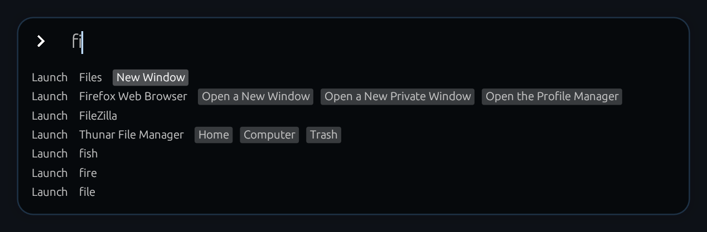
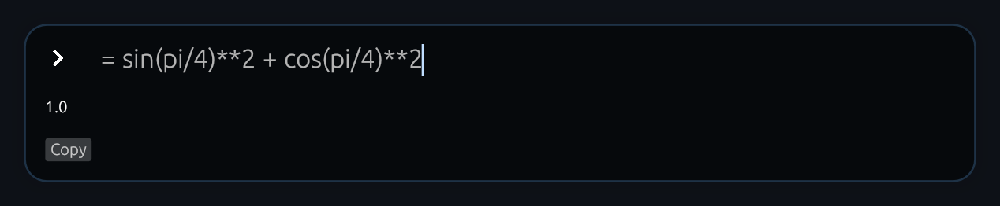

# Vonal global search

Vonal is a modern alternative to `dmenu`, `rofi`, `albert` etc...
Ideal for tiling window managers.

Currently only X11 is supported. (If you need Wayland support, please tell me.)

## Installation & Usage

### 1. Installation

Build from source (Rust is required):
 - `cargo build --release`

*Alternatively:* Install from binary **on Archlinux**:

- `yay vonal-bin`

*Alternatively:* install from binary **for other distros**:

- Check releases: https://github.com/fxdave/vonal-rust/releases

### 2. Usage

- Start the daemon: `./target/release/vonal`
- Show the window: `./target/release/vonalc toggle`

<small>(They have to be called from the same directory.)</small>

*Optionally*: If you use **bspwm**, an example rule to keep Vonal floating:
- `bspc rule -a vonal state=floating border=off`

# Plugins

## launcher_plugin


A fuzzy search for .desktop files and executables in $PATH, supporting sub-actions
  - trigger: anything
  - shortcuts:
    - Up, Down, Left, Right, Enter
  - example commands:
    - `chr` finds chromium
    - `chr github.com` finds chromium and on enter, it opens it with `github.com`
    - `,` is for settings like reload application cache
## math_plugin


A python proxy
  - trigger: `=`
  - example commands:
    - `= sin(radians(90))` prints `1.0`
    - `= [i for i in range(1000) if i %99 == 0]` shows the numbers between 0 and 999 that are dividable by 99
## pass_plugin


A configurable password manager plugin. It works with every password managers, however, the default config is only for GNU pass. This is not meant to be used from the search menu although you can reach it that way as well.
  - suggested binding: `super+p` `vonalc set_query "pass " show`
  - trigger: `pass`
  - example commands:
    - `pass fa` list every account name containing "fa"

Warning: On update you have to manually enable new plugins.

# CLI

Synopsis: `vonalc commandA arg1 arg2 commandB arg1 ...`

- `show`: show the window
- `hide`: hide the window
- `toggle`: show/hide the window
- `set_query "something"`: writes the word "something" to the searchbar.

# Configuration

The configuration file is created on the fly to `~/.config/vonal/config.toml`.
You can see every existing config options, there.

# Contribution

Please let me know if you would like to use it. It would motivate me to work on the project.
Open any issues about new ideas. Tell me what plugins would you want to see.

Develop your own plugins, it's easy!
I put serious effort to make plugins both unlimited and simple.

The GUI is done with [egui](https://github.com/emilk/egui), which is tailored for quick progress.

An example plugin:

```rust

struct SayHiPlugin {}

impl Plugin for SayHiPlugin {
    fn search(
        &mut self,
        query: &mut String,
        ui: &mut Ui,
        _window: &GlutinWindowContext,
    ) -> PluginFlowControl {
      if query.starts_with("hello") {
        ui.label("Hi!");

        return PluginFlowControl::Break
      }


      PluginFlowControl::Continue
    }
}

```
